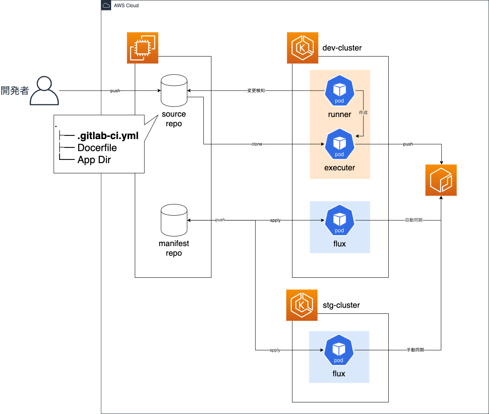

[[_TOC_]]

---

# 概要説明

## アプリケーション開発

### 背景
CICD導入の前は次の様なフローで開発をしていました。まず、アプリケーション開発者がソースの作成/修正します。そして、必要に応じてビルドやテストを行い、問題なければ"source repo"にソースコードを格納します。この段階を``アプリ開発``と名付けます。その後、修正したソースを使用してdocker buildを行い、コンテナイメージを作成します。作成したコンテナイメージをプライベートなコンテナレジストリにdocker pushします。これはアプリケーション開発者またはインフラ管理者で行います。この段階を``コンテナ作成``と名付けます。最後に、インフラ管理者がK8sマニフェストのイメージ部分を修正し、K8sへデプロイします。この段階を``K8sデプロイ``と名付けます。図にすると以下の様になります。

上記フローでも開発は可能でしたが以下の様な課題を抱えていました。
1. 開発者のローカル端末で作業すると”source repo"への"push"を忘れることがある。
2. 手動でdocker buildしている間、開発者のターミナルが専有されてしまう。数秒で済めば良いが長いと数分手が止まってしまう。
3. イメージに付けるタグを決めるのにいちいちコンテナレジストリの既存イメージタグを確認するのが面倒。
4. (ECRのため)コンテナレジストリへpushする前に"docker login"が必要。しかも12時間毎にトークン再取得も必要。
5. ``アプリ開発``と``コンテナ作成``を別々の担当者で実施すると資材の受け渡しに時間がかかる。また、資材のバージョンがデグレることもある。
6. コンテナイメージを書き換えるだけなのにK8sマニフェスト更新のためissueを立て、ブランチを作り、修正し、マージする一連の作業が面倒。
7. すべて手動かつ開発者とインフラ担当のやり取りが発生するためフロー完了まで20分ほどの時間を要する。

### CICDによる効果
CICD導入後は次の様なフローとなります。まず、アプリケーション開発者がソースの作成/修正し"source repo"へ"push"します。この"source repo"への"push"をトリガーにあとはすべて**自動**で行われます。必要に応じアプリケーションのビルド/テストが実行されます。その後、"docker build&push"が行われます。コンテナレジストリに最新のイメージが"push"されるとK8sマニフェストを書き換え、K8sへのデプロイが実行されます。導入前の``アプリ開発``に相当する部分の自動化を``Continuous Integration``と呼び、``コンテナ作成``の部分を``Continuous Delivery``、``K8sデプロイ``の部分を``K8sデプロイ``と呼びます。（呼び方については諸説あるため本PJにおける呼び方です。）

CICDを導入することで課題は以下のように解決されました。
1. ”source repo"への"push"がトリガーなのでpusu忘れがなくなる。
2. "docker build&push"はCICDを行うサーバの中で行うためターミナルを専有しない。
3. 重複しないイメージタグを自動で付与するため事前確認が不要。
4. プライベートレジストリへの認証をCICDを行う環境でスケジュール実行しているため手動でログイン不要。
5. 資材の受け渡しはCICDの中で自動的に行われるため手動連携不要。
6. K8sマニフェストの修正、push、applyまですべて自動で行われる。
7. コミュニケーションオーバヘッドがなくなり、自動で実行されるためフロー完了まで2分くらいで終わる。(docker build&pushの時間しだい)

## インフラ

### 背景

CICD導入の前は次の様なフローで開発をしていました。インフラ管理者がK8sのマニフェストを更新し開発環境にデプロイして動作を確認します。期待した動作を確認した後、ステージング環境にデプロイします。K8sマニフェストはKustomizeで管理しており、baseとoverlay(dev/stg)に分けています。baseは環境で共通するマニフェスト、overlayは各環境固有のマニフェストです。

上記フローでも開発は可能でしたが以下の様な課題を抱えていました。
1. K8sへのapplyは手動のため、K8sマニフェストレポジトリの状態と実機の状態が一致していないことがある。
2. 設計方針で必須としているパラメータが設定されていなくてもデプロイできてしまう。（マニフェストの確認を目視でしかできていない）
3. stgへデプロイする時にstg用のパラメータを設定し忘れる。
4. devのマニフェストを誤ってstgにデプロイする事故が発生する。（逆もあり。）

### CICDによる効果

CICD導入後は次の様なフローとなります。devに対する修正はdev用のブランチに取り込みます。dev用ブランチが更新されると自動でdevのK8sにデプロイされます。devで動作を確認した後、dev用ブランチからstg用ブランチへ修正を取り込みます。stg用ブランチが更新されると自動でstgのk8sにデプロイされます。また、各ブランチが更新されると自動でマニフェストが設計方針にしたがっているかポリシーチェックを実行します。

CICDを導入することで課題は以下のように解決されました。
1. k8sとk8sレポの状態が常に等しい。
2. ポリシーチェックを自動で行うため、ポリシー違反に気が付きやすくなる
3. stg用のパラメータの設定不備にも気が付きやすくなる
4. 自動でデプロイされるため、環境間違いによるデプロイ事故が発生しない。

# アーキテクチャ

## アプリケーション開発フロー
実装したCICDのフローをもう少し整理すると以下の図となります。"source repo"および"k8s manifest repo"は``GitLab``を使用しています。また、CIとCD(Delivery)は``GitLab CI/CD``を使用します。プライベートコンテナレジストリは``ECR``を使用します。CD(Deploy)は``Weaveworks Flux``を使用し、devおよびstgそれぞれにDeployする環境を整えます。"source repo"は「feture」と「master」のブランチを使用使用する``GitHub Flow``を使用します。「masuter」ブランチに変更が発生するとパイプラインが実行されます。

## インフラ開発フロー
"k8s manifest repo"のCICDはCIとCD(Depoly)を行います。また、ブランチ戦略として「feture」「master」「staging」の3つのブランチを使用する``GitLab Flow``を採用しています。CIで行うテストは``OpenPolicyAgent Conftest``を使用します。ブランチに変更がpushされると``GitLab CI/CD``により``OpenPolicyAgent Conftest``が実行され、K8sマニフェストのチェックを行います。masterおよびstagingブランチに変更がpushされると``Weaveworks Flux``によりK8sクラスタへマニフェストが自動でデプロイされます。

## システムアーキテクチャ
サーバ構成などのアーキテクチャよりの図は以下の通りとなります。``GitLab``はステートフルなデータを扱いIPアドレスも固定化したいため、コンテナではなくEC2のサーバで構成します。``GitLab CI/CD``を動かす"runner"および"executer"はK8s上に構成します。``Weaveworks Flux``はそれぞれのK8sクラスタ上に構成します。

# ブランチ戦略説明
"source repo"では``GitHub Flow``、"k8s manifest repo"では``GitLab Flow``を採用しています。他にも``Git Flow``という戦略もあります。各戦略について説明します。なお、次の参考ページをまとめた内容です。[Introduction to GitLab Flow](https://docs.gitlab.com/ee/topics/gitlab_flow.html)

## Git-flow 
以下5種類のブランチを使い分ける戦略。通常の開発はdevelopブランチをベースに行う。何らかの修正を加えた場合、developブランチからfeatureブランチを作成し、修正が完了したらdevelopにマージする。ある程度の修正を加えたのち、それらを本番にリリースするためdevelopブランチからreleaseブランチを作成する。releaseブランチでは本番適用前の準備(細かなブラシュアップやドキュメント)を行う。準備が完了したらreleaseブランチからmasterブランチにマージして本番へリリースする。もし本番で何らの不具合がありすぐに対処が必要な場合、masterブランチからhotfixブランチを作成し修正を行う。修正が完了したらmasterブランチとdevelopブランチの両方にマージする。
- master
- hotfix
- release
- develop
- feature

この戦略はリリースするバージョンやタイミングを制御したい場合に有効です。たとえばパッケージで提供しているソフトウェアなどです。

## GitHub-flow
以下2種類のブランチを使い分ける戦略。masterは常にデプロイ可能な状態とする。修正を加える時はmasterブランチからfeatureブランチを作成し、修正完了したらmasterにマージする。
- master
- feature

この戦略は常に最新のものをデプロイしたい場合に有効な戦略です。たとえばコンテナイメージのもととなるソースレポジトリなどです。

## GitLab-flow 
以下3種類のブランチを使い分ける戦略。通常の開発はmasterブランチをベースに行う。何らかの修正を加えた場合、masterブランチからfeatureブランチを作成し、修正が完了したらmasterにマージする。masterブランチで動作を確認したのち問題なければproductionブランチにマージします。(場合によってはproductionブランチの前にstagingブランチなどを設け、より本番に近い環境でテストしてからproductionブランチにマージしても良いです。)
- master
- production
- feature

この戦略は環境差異を含むレポジトリの管理に有効な戦略です。たとえばK8sのマニフェストなどです。

# ツール説明
CICDに使用するツールについて説明します。

## GitLab CI/CD
GitLabで使用できるCICDツールです。v8以上のGitLabには標準で組み込まれています。GitLab CI/CDでは実行する一連の処理をpiplineと呼び、個々の処理をjobと呼びます。1つのpiplineには複数のjobを定義できます。piplineやjobは``.gitlab-ci.yml``という名前のファイルに記述します。このファイルはレポジトリのルートに配置する必要があります。そのため、アプリケーションごとにpiplineを分けたい場合、レポジトリから分けることとなります。

GitLab CI/CDを使うには``GitLab Runner``というツールを別途用意します。``GitLab Runner``はレポジトリの変更を検知しpiplineの制御をするものです。Runnerは共有のものや特定レポジトリ専用のものとして構成できます。Runnerがjobを実行する場所は``executor``で選べます。executorはDockerやVirtualBox,Kubernetesなどが指定できます。

[公式ページ](https://docs.gitlab.com/ee/ci/)

## Weaveworks Flux
K8s専用のデプロイツールです。Fluxは管理対象のK8sクラスタで動くPodのimageを管理します。Fluxではこれをworkloadと表現します。コンテナレポジトリに新しいタグが追加されるとFluxはそれを検知し、自動または手動コマンドでK8sマニフェストを更新しK8sマニフェストレポジトリへ変更をpushします。また、FluxはK8sマニフェストレポジトリの変更を検知し、自動でK8sクラスタにデプロイします。Flux自体はK8sクラスタ上にPodとして構成します。

[公式ページ](https://www.weave.works/oss/flux/)

## Open Policy Agent
Open Policy Agent(通称OPA)はK8sマニフェストやTerraformコードなどの内容が定めたポリシーに準拠しているか確認するツールです。ポリシーはRegoという言語で記述します。K8s環境にOPAを導入する方法は2つあります。1つ目はkube-apiserverのadmission-controlに組み込み、K8s環境にリソースをデプロイする前にポリシーチェックを行う方法です。2つ目はCIなどでマニフェストを作成した時点でポリシーチェックを行う方法です。1つ目の方法はK8sへデプロイする直後に確認するため、必ずポリシーチェックが行われます。2つ目はCIなどのフローに従えばチェックされますが、フローから逸脱した手順（たとえば手動apply）ではチェックを通らない可能性があります。1つ目を実装するツールが``OPA/Gatekeeper``、2つ目を実装するツールが``OPA/conftest``です。

[公式ページ](https://www.openpolicyagent.org/)